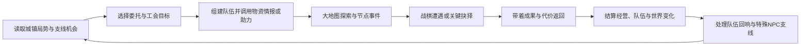
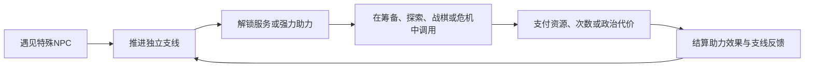
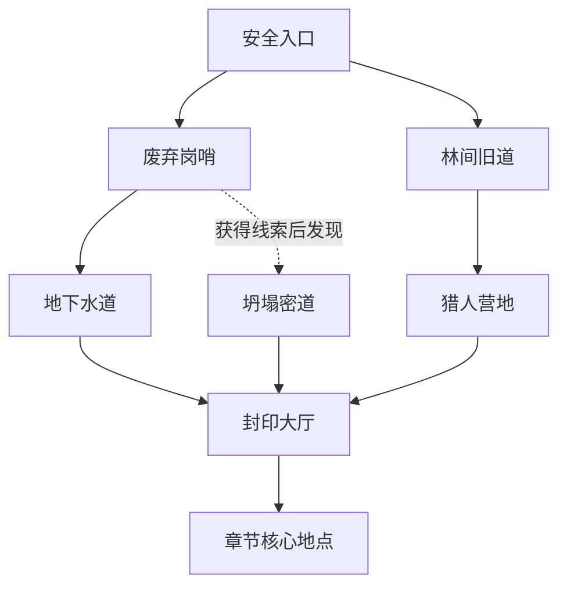
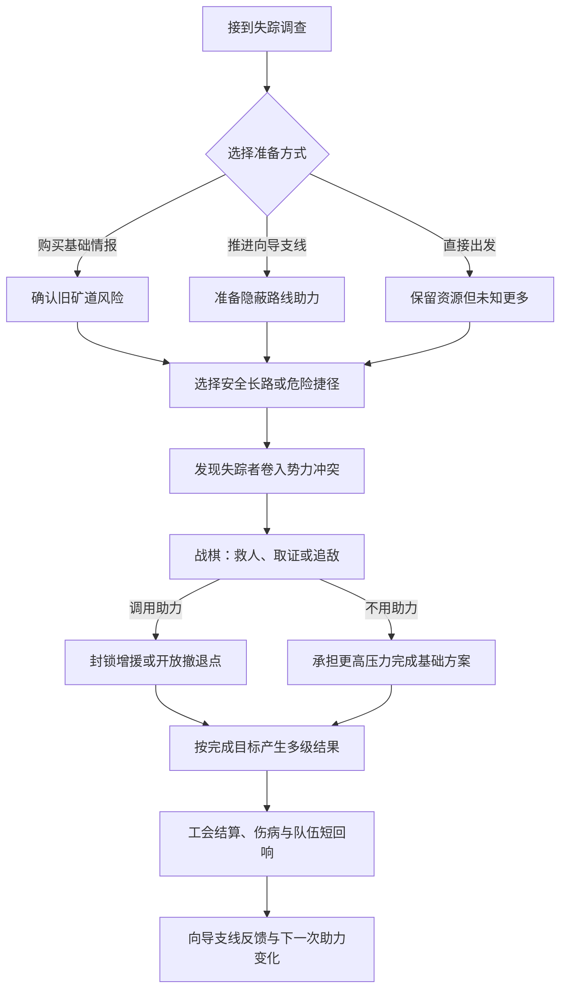

# 《未定名：冒险者工会》初步游戏设计案

> 文档阶段：概念与系统框架初稿  
> 设计范围：核心体验、系统循环、心流、冒险者管理、特殊 NPC 支线与助力、失败恢复、原型范围  
> 暂不包含：详细战斗数值、职业技能表、装备词条、完整剧情文本、美术与技术规格

---

## 1. 项目概述

### 1.1 游戏定位

一款西方奇幻题材的单机冒险者工会模拟经营 RPG。玩家扮演新任工会会长兼远征领队，在城镇中招募、培养和调度冒险者，承接委托、经营设施并联络各方人士；随后带领小队进入区域大地图，在节点间探索、调查和做出剧情选择，并在关键遭遇中进入小规模战棋地图。

游戏的长期吸引力来自三条相互回流的内容线：管理具有职业与状态差异的冒险者队伍；探索不断变化的区域并承担任务后果；结识少量拥有独立个人故事的特殊 NPC，通过完成可选支线获得强力而有条件的帮助。普通冒险者与主角之间不建立亲密、恋爱或个人关系成长，其人物感主要通过工作表现和冒险者之间简短的情绪互动呈现。深度人物故事与可选恋爱内容集中在特殊 NPC 身上。

### 1.2 一句话体验

**经营一支不断成长的冒险者队伍，借助各具专长的特殊人物踏入未知之地，并让每次远征的成果与代价改变下一次选择。**

### 1.3 核心体验支柱

1. **未知但可推理的冒险**  
   地图节点不会把答案全部公开，但玩家可以通过情报、环境线索、冒险者专长、特殊 NPC 助力和前次失败逐步理解风险。未知带来期待，信息让选择具有依据。

2. **以调度和状态为核心的经营**  
   冒险者不是可随意替换的数值卡。职业适配、伤病、疲劳、士气、压力和队伍氛围都会进入排班、接单和远征决策，但不需要经营他们对主角的个人情感。

3. **可选但高价值的特殊 NPC 支线**  
   特殊 NPC 拥有独立个人故事、鲜明专长和强力助力。支线不会阻塞主线，却能改变情报质量、经营手段、地图路线、战棋条件和失败恢复方式。

4. **失败推动局面继续**  
   撤退、负伤和任务部分失败会制造债务、补救任务、队伍压力与新的求助机会，而不是频繁要求读档重来。

5. **选择留下可见痕迹**  
   工会空间、城镇状态、冒险者队伍、特殊 NPC、地图通路和结局附录都应持续反馈玩家的决定。

### 1.4 目标玩家

- 喜欢角色驱动支线、特殊 NPC 故事和可选恋爱内容的 RPG 玩家。
- 喜欢轻至中度经营规划，但不希望处理高密度流水账的玩家。
- 喜欢探索未知地点、阅读事件并权衡风险的玩家。
- 喜欢小队构筑与战棋决策，但不以极端数值研究为主要乐趣的玩家。

### 1.5 设计边界

- 经营是为了制造有意义的取舍，不追求高度拟真的税务、人事和库存模拟。
- 战棋强调目标、地形、情报和队伍协作，不以堆叠大量伤害公式为主要深度。
- 普通冒险者与主角之间不存在信任、亲密、恋爱或个人结局路线。
- 冒险者之间的情绪交互保持简短、笼统和低影响，不发展为复杂关系网络。
- 深度个人故事和恋爱内容只属于特殊 NPC；友情、合作等非恋爱路线同样完整，且不影响主线进程。
- 特殊 NPC 助力必须有解锁条件与使用限制，同时保留不依赖助力的基础解法。
- 主线提供方向与压力，但不使用持续倒计时迫使玩家放弃探索和支线内容。
- 不以随机永久死亡作为默认难度核心；高风险模式可作为独立选项讨论。

---

## 2. 玩家身份与核心幻想

### 2.1 玩家身份

玩家扮演一名拥有明确社会身份、但人格表达空间较大的会长。玩家可以通过委托选择、工会政策、谈判和任务决策表现价值观。主角同时具有领队身份，因此玩家亲自操作的远征和战棋在叙事上成立；工会发展到中期后，也可以将次要委托交给其他小队抽象执行。

主角不需要成为队伍中战斗力最高的人。其核心能力是：

- 决定工会接受什么工作、拒绝什么代价。
- 组织不同职业与状态的冒险者共同远征。
- 在信息不完整时判断风险并承担责任。
- 与特殊 NPC、势力和城镇机构谈判，建立可调用的外部支持。
- 将有限资源和特殊助力用在最能改变局面的时机。

玩家与普通冒险者的联系是明确的管理与带队关系。玩家关注他们的能力、健康和队伍氛围，但不经营任何冒险者对主角的信任、亲密或恋爱情感。

### 2.2 玩家长期幻想

游戏开始时，工会只是一个缺乏资金、声望、可靠成员与外部支援的小据点；游戏结束时，它应成为玩家亲手塑造的成熟组织。不同玩家的工会可能是受平民信赖的救援组织、追逐遗迹的探索团、贵族认可的精英机构，或游走在多方势力之间的独立力量。

“成功”不仅由工会等级定义，也由以下问题共同回答：

- 冒险者队伍是否形成了稳定而有弹性的人员结构？
- 工会愿意为什么原则承受损失？
- 城镇因工会发生了什么变化？
- 玩家完成了哪些特殊 NPC 支线，又获得了哪些独特支持？
- 那些被探索的遗迹和秘密最终被如何处理？

---

## 3. 总体系统循环

### 3.1 核心循环



该循环的体验可以概括为：

> **接受责任 → 准备队伍与支援 → 走入未知 → 承担结果 → 处理队伍状态与支线回响 → 获得新的选择空间**

### 3.2 四层循环

| 层级 | 典型时长 | 核心问题 | 主要反馈 |
| --- | --- | --- | --- |
| 节点循环 | 2–8 分钟 | 这个地点是否值得冒险？ | 线索、资源、状态、局部剧情 |
| 远征循环 | 20–40 分钟 | 如何利用队伍与支援完成目标并返回？ | 委托结果、伤病、发现、队伍氛围 |
| 行动周期 | 45–60 分钟 | 工会本周期优先处理什么？ | 财务、声望、设施、特殊 NPC 支线、世界推进 |
| 章节循环 | 2–4 小时 | 工会如何回应一场区域危机？ | 区域变化、势力态度、支援网络、主线分支 |

### 3.3 行动周期

一个标准行动周期由四个阶段组成：

1. **筹备阶段**  
   查看新委托、城镇消息、特殊 NPC 支线和冒险者状态；选择主目标；处理少量高价值经营决策；组队并配置物资、情报与可用助力。

2. **远征阶段**  
   在区域大地图移动，通过节点事件收集信息、消耗资源、改变路线；关键冲突进入战棋地图。特殊 NPC 助力可以改变局面，但不会替代玩家决策。

3. **结算阶段**  
   处理任务评价、报酬、伤病、战利品、队伍情绪标签、势力反应和城镇变化。结果必须说明“为什么发生”，避免只显示数值增减。

4. **回响阶段**  
   先处理冒险者之间简短的争执、庆祝、照顾或竞争事件，再由玩家决定是否推进特殊 NPC 支线、领取新助力或为下一周期保留机会。

行动周期是主要时间单位。游戏不要求玩家逐小时安排所有角色，以免经营阶段陷入重复排班。只有会影响选择的时间才进入系统，例如伤员恢复、限期委托、特殊 NPC 支线阶段和城镇事件进展。

### 3.4 跨系统连接原则

为了避免经营、支线、探索和战棋像四个彼此分离的小游戏，每次重要行为原则上应产生至少两类结果。

| 玩家行为 | 即时结果 | 跨系统结果 |
| --- | --- | --- |
| 接受低报酬救援委托 | 获得一场远征 | 平民声望提高，挤占盈利机会，可能引出特殊 NPC 支线 |
| 带特定职业组合调查遗迹 | 获得专属节点选项 | 形成轻量队伍情绪事件，并改变后续组队取舍 |
| 在战棋中保护证人 | 战斗目标更困难 | 解锁情报、审判剧情和新的委托链 |
| 完成流动医师的支线阶段 | 获得紧急医疗支援 | 医务室解锁新处置方式，远征重伤损失可以降低 |
| 调用外交家的势力调停 | 降低一次政治冲突 | 消耗人情或增加另一势力的不满，后续支援进入冷却 |
| 忽视冒险者之间的短期摩擦 | 节省当期处理时间 | 队伍氛围暂时下降，但不会形成永久关系线或阻塞主线 |

**关键约束：**普通冒险者只输出队伍状态与轻量互动；深度人物内容和强力个人帮助只来自特殊 NPC。任何助力都不应只等于数值加成，也不能成为完成主线的唯一门票。

### 3.5 特殊 NPC 支线与助力回流



特殊 NPC 支线的核心价值是扩大玩家的解决方案，而不是为主线设置前置条件。助力可以显著改变难度、路线或代价，但每种助力都必须明确以下内容：

- 解锁条件与当前可用状态。
- 生效阶段和具体作用。
- 该 NPC 独立的次数、冷却、资源、人情或势力代价；这些限制不与其他特殊 NPC 共用同一条数值。
- 不调用助力时仍可采用的基础方案，且主线必要路线必须存在至少一种不依赖特殊 NPC 的发现或通行方式。
- 使用后对该特殊 NPC、其支线或相关势力产生的反馈。

---

## 4. 局外：工会模拟经营

### 4.1 经营目标

经营部分不要求玩家找到唯一最优生产链，而是持续回答三个问题：

1. 工会现在最缺什么？
2. 哪些机会值得承担人物与资源风险？
3. 这个工会愿意成为什么样的组织？

### 4.2 核心资源

资源种类应保持精简，每种资源承担不同决策职能。

| 资源 | 作用 | 设计意图 |
| --- | --- | --- |
| 资金 | 维持工会、采购、设施建设和处理危机 | 形成持续但不过度急迫的生存压力 |
| 补给 | 远征中的治疗、露营、工具与应急手段 | 将筹备决策带入地图，而非只做出发门槛 |
| 情报 | 揭示节点风险、隐藏路线、敌方特性和委托真相 | 让未知可被经营行为逐步驯服 |
| 工会声望 | 决定委托层级、招募对象和公共信任 | 同时带来机会与更高期待，不是纯粹越高越好 |
| 势力关系 | 分别记录教会、贵族、商会、民众等态度 | 制造价值冲突，原则上不能一次讨好所有势力 |
| 支援联络位 | 表示本周期能准备多少名特殊 NPC 或多少项外部支援 | 让玩家在不同类型的帮助之间做出战略选择，而非同时调用全部支援 |

冒险者的压力、士气和队伍氛围属于队伍状态，不可像货币一样消费。每名特殊 NPC 的帮助都由各自的支线进度、专长、次数、冷却、资源、人情或政治代价独立决定。

### 4.3 委托系统

委托是所有系统的主要入口，应同时提供目标、风险、可用手段与潜在后果。

#### 委托类型

- **常规委托：**维持收入与经营节奏，提供可预测的冒险内容。
- **调查委托：**信息不完整，需要在地图上收集证据后决定真正目标。
- **势力委托：**影响派系关系和城镇格局，常带有相互冲突的要求。
- **特殊 NPC 支线委托：**推进独立个人故事并解锁或强化助力，不作为主线前置。
- **危机委托：**由世界状态触发，若暂不处理也会产生明确、可理解的变化。
- **主线委托：**推进章节核心谜团或区域危机。

#### 委托呈现

接单界面应优先显示：

- 委托人公开提出的目标。
- 已知环境与可能遭遇。
- 报酬、期限和政治立场。
- 推荐能力，而不是强制职业。
- 可能受到影响的人或地区。
- 情报可信度，例如“确认”“传闻”“委托人自述”。
- 当前可调用的特殊 NPC 助力及其次数、代价和限制。
- 不使用特殊助力时可行的基础准备方向。

玩家可以带着不充分情报出发，但不能因界面隐瞒关键规则而受罚。未知应来自世界，而不是来自表达不清。

### 4.4 成员管理

每名可出战冒险者由五类信息构成：

- **职责：**其在探索、战棋和工会中的主要作用。
- **特质：**稳定的职业与经历标签，可开启事件选项，也可能带来限制。
- **当前状态：**伤病、疲劳、压力、士气与临时工作诉求。
- **队伍标签：**与当前小队相关的简短状态，例如“配合顺畅”“彼此较劲”“照顾伤员”。
- **成长方向：**战斗专精、探索能力、岗位资质和领队能力。

成员管理的主要决策是“让谁承担什么、如何组成队伍”，而不是经营冒险者对主角的情感，或频繁为每个人更换微小数值装备。冒险者可以拥有简短背景与工作偏好，但不配置独立长篇个人故事、恋爱路线或专属结局分支。

#### 非出战成员的价值

留守成员可以承担工会岗位，例如情报整理、训练新人、接待委托、协助医疗或带领次要小队。岗位产生功能差异和事件条件，使玩家不必把所有高能力角色都塞进同一支出战队伍。

### 4.5 设施系统

设施升级优先解锁新的行为与解决方案，其次才是效率提升。

| 设施 | 主要解锁方向 | 可承接的特殊助力 |
| --- | --- | --- |
| 委托厅 | 更多委托来源、谈判、筛查虚假委托、处理公共事件 | 外交斡旋、担保、特殊委托转介 |
| 情报室 | 节点预判、敌情记录、线索拼接、远征路线规划 | 学者分析、向导路线、敌方内情 |
| 工坊 | 特殊工具、地图互动手段、装备维护与委托物品分析 | 工匠改造、炼金工具、一次性机关方案 |
| 医务室 | 伤病处置、长期治疗选择、救援类事件 | 专家会诊、紧急救援、重伤转化处理 |
| 训练场 | 新成员磨合、职业协同、战前演练 | 教官训练、针对性演练、临时战术方案 |
| 公共厅室 | 冒险者休整、访客事件、节庆与短期摩擦调解 | 特殊 NPC 会面、支线事件与支援联络 |

设施不是特殊 NPC 助力的自动生产线，而是让相关专家有条件为工会提供帮助。助力仍由特殊 NPC 的个人支线和身份专长解锁，并保留使用限制。

#### 支援联络位

工会在中期开放有限的“支援联络位”。玩家可以让少量特殊 NPC 在本周期与特定设施协作，从而准备其助力。联络位的限制迫使玩家选择当前更需要情报、医疗、外交还是战术支援，避免已经结识的所有特殊 NPC 同时提供最大效果。

### 4.6 工会政策

章节节点允许玩家确立或调整少量工会政策，例如：

- 是否接受高风险遗迹发掘。
- 对无力付费的求助者采取何种规则。
- 是否与特定势力共享情报。
- 成员能否拒绝涉及其私人立场的委托。

政策不是简单的永久加成，而是工会价值观的制度化表达。它会筛选委托、改变势力态度，并影响某些特殊 NPC 是否愿意提供特定帮助。个人支线仍可继续，但相关助力的成本、形式或政治后果可能变化。

### 4.7 次要小队派遣

中期开放抽象派遣，用来体现工会规模增长并消化非主力成员。玩家只决定任务、领队、队伍倾向、资源支持和是否调用特殊助力，结果由任务风险、队伍适配、冒险者状态与有限随机共同决定。

约束如下：

- 不与主远征同步进行逐回合管理。
- 结果可预估为风险区间，不展示虚假的精确成功率。
- 失败产生可处理的后续问题，不轻易随机夺走重要冒险者。
- 主线剧情、特殊 NPC 支线关键节点和重大世界选择仍由玩家亲自参与。
- 特殊助力可以降低风险，但不能保证派遣成功或取消全部失败后果。

---

## 5. 局内：区域大地图探索

### 5.1 地图结构

每个区域由一张手工设计的节点网络构成。玩家在已发现节点之间移动，节点代表废墟、聚落、岔路、营地、地下入口、异象或人物相遇点。路线选择同时考虑目的、补给、风险和队伍状态。



地图不是一次性关卡列表。节点可能因时间、任务、人物和世界状态发生变化：白天是废墟，夜晚出现秘密集会；救下猎人后开放捷径；破坏封印后，原本安全的路线被敌人占据。

### 5.2 节点信息层级

每个节点可以经历三个认知阶段：

1. **传闻：**只知道大致主题和不可靠描述。
2. **识别：**通过侦察、情报或邻近节点获知主要风险与可能收益。
3. **掌握：**完成关键事件后，成为安全点、稳定资源点、捷径或已解决地点。

这种结构让探索进度不只等于“地图点亮百分比”，而是玩家逐渐建立对区域的理解。

### 5.3 节点类型

- **剧情节点：**对话、抉择、人物冲突或主线信息。
- **调查节点：**观察、推理、使用专长或物品获得线索。
- **风险节点：**陷阱、环境危害、追踪、疾病或补给消耗。
- **战斗节点：**进入战棋地图，目标可能随此前调查结果变化。
- **营地节点：**恢复、队内交流、处理伤势，但可能推动时间或暴露行踪。
- **地标节点：**建立捷径、视野或长期区域优势。
- **秘密节点：**由线索、成员经历、特定时间或多周目知识发现。

### 5.4 节点事件结构

一个有效节点事件应包含以下内容：

1. 玩家进入前可感知的线索。
2. 当前问题或诱惑。
3. 由冒险者技能、工会设施、情报、特殊 NPC 助力或价值选择产生的多个处理方式。
4. 可预期的代价类型，例如耗时、受伤、暴露、资源或支援次数；不必公开精确结果。
5. 对后续地图、战棋、特殊 NPC 支线或世界状态的至少一种影响。

不同输入应提供“新的做法”，而不只是提高同一选项的成功率。例如，猎人能识别伪造足迹，工坊工具能固定坍塌通道，遗迹学者可以远程辨认封印，而前敌方向导能够开放一条有次数限制的撤退路线。

普通冒险者之间的队伍标签只产生短对话或轻微状态变化，不作为隐藏路线和关键剧情的硬性解锁条件。主线必要路线必须至少有一种由冒险者技能、工会设施、基础情报或常规探索发现的非特殊 NPC 通路；特殊 NPC 助力只提供捷径、额外信息、降低代价或更安全的替代方案。

### 5.5 探索压力

远征压力主要来自：

- 补给逐步消耗。
- 伤病、疲劳与士气累积。
- 部分目标具有合理期限。
- 敌对势力会根据行动提高警戒。
- 特殊助力的次数、冷却或代价限制。
- 队伍氛围在连续受挫后暂时恶化。

这些压力应促使玩家判断“继续深入、调用助力，还是带着已有成果返回”，而不是单纯限制游玩时间。撤退必须是被系统承认的策略。

### 5.6 回访与便捷性

区域允许回访，但避免重复走图：

- 已掌握的安全节点可快速通过。
- 建立营地或地标后开放区域内起点。
- 已解决的普通事件不会原样重复。
- 新章节只在少量旧节点加入有意义的变化。
- 界面明确标记“新变化”“未解线索”和“当前任务相关”，降低无效搜索。

---

## 6. 局内：战棋遭遇

### 6.1 战棋定位

战棋是探索过程中风险、队伍构筑与前期准备的集中兑现。它不应吞没经营和叙事，也不能退化为剧情之间的例行清场。每场关键战斗都应回答一个具体问题：玩家要保护什么、争取什么、牺牲什么，或者从何处撤离。

### 6.2 战斗前循环

进入战棋前，玩家应能利用此前获得的信息进行判断：

- 当前主要目标与可选目标。
- 已知敌人、地形和环境机制。
- 可选择的入口、部署或交涉机会。
- 当前可调用的特殊 NPC 助力及其代价。
- 撤退条件与失败可能造成的后果。
- 哪些情报仍不确定。

探索中的调查和特殊助力可以改变战棋开局，而不是只提供伤害加成。例如：关闭机关、说服一名守卫离场、从高处部署、让目标 NPC 愿意跟随、揭示真正敌人，或预先建立一条撤退路线。

### 6.3 战斗中核心决策

战棋深度主要来自以下维度：

- **位置：**掩体、高低差、狭窄通道、视野与危险区域。
- **行动顺序：**何时先手压制、延后行动、保护受伤成员或抢占目标。
- **目标冲突：**击败敌人、救援、撤离、阻止仪式、获取证据可能无法全部完成。
- **有限资源：**强力技能、消耗品、特殊支援和环境机关需要选择使用时机。
- **队伍协作：**职业组合、站位配合、战前演练和当前队伍氛围共同影响协作表现，不使用主角关系值或复杂冒险者关系网。
- **环境变化：**增援、坍塌、火势、平民移动等使战场阶段发生变化。

轻量的队伍摩擦最多造成短期士气或协作惩罚，不会让冒险者突然拒绝玩家命令，也不会锁死关键战术动作。

### 6.4 遭遇目标设计

为避免“全部消灭”成为唯一答案，遭遇目标可包括：

- 坚守到撤离路线打开。
- 护送或说服某个目标离场。
- 在敌方完成仪式前破坏多个关键点。
- 取得证据后主动撤退。
- 在不伤害被控制者的前提下制服首领。
- 分头完成互斥目标并决定放弃哪一项。
- 通过对话、展示证据或特定人物行动中止战斗。

### 6.5 队伍回响与特殊支援反馈

战斗结果需要产生可读的队伍反馈，而不只产生经验值：

- 谁冒险救了另一名冒险者。
- 谁在恐惧中坚持或失控。
- 哪两名冒险者在本场配合顺畅或出现摩擦。
- 小队是带着伤者撤退，还是为额外目标继续冒险。
- 某项特殊助力是否被使用，以及它解决了什么问题、付出了什么代价。

普通冒险者的记录在结算时转化为简短队内对话、临时士气变化或有限搭档标签，通常在一个行动周期内消退或被新事件覆盖，不形成主角关系线、长篇个人支线或恋爱内容。

特殊 NPC 的支援记录可以推进其独立支线或改变下一次助力。例如，流动医师成功完成一次战场转运后开放更高级的重伤处置；外交家的身份被公开使用后，相关势力会提高警惕。助力反馈强调因果与代价，而非好感度上涨。

### 6.6 特殊 NPC 介入边界

特殊 NPC 可以通过以下方式显著改变战棋：

- 提供更准确的部署情报或标记敌方弱点。
- 预先开启侧翼入口、撤退点或环境机关。
- 在明确条件下实施一次医疗、运输或掩护支援。
- 创造交涉窗口，允许玩家用证据或行动提前结束战斗。
- 保护一个可选目标，减少玩家需要同时处理的战场压力。

特殊 NPC 原则上不作为常驻可控棋子，也不直接消灭主要敌人或替玩家完成主要目标。每项强力介入必须预先显示触发条件、次数与代价；没有该助力时，战斗仍保留难度更高但合理可行的基础方案。

### 6.7 战斗长度与密度

- 普通遭遇应快速表达一个战术主题。
- 关键遭遇可有阶段变化，但控制总时长，避免连续多场战斗阻断剧情记忆。
- 一次标准远征以 0–2 场有意义的战棋为宜；纯调查或社交委托可以没有战斗。
- 重复型资源战不作为常规内容填充手段。

### 6.8 难度与可读性

- 威胁范围、目标进度、环境规则和撤退条件始终清楚。
- 随机性用于制造局面变化，不用于突然抹除长时间经营成果。
- 难度选项分别影响容错、敌方决策强度、伤病后果和信息提示，避免只调整生命与伤害倍率。
- 允许在远征外调整难度；关键失败后可直接重试战棋，或接受结果继续故事。

---

## 7. 冒险者互动与特殊 NPC 支线

### 7.1 角色分层

| 层级 | 主要作用 | 内容深度 | 与主角的关系 |
| --- | --- | --- | --- |
| 普通冒险者 | 出战、探索、工会岗位与次要派遣 | 职业成长、状态变化、简短背景和轻量队内互动 | 仅为会长与成员的管理关系，不发展亲密或恋爱路线 |
| 特殊 NPC | 提供独特身份、个人支线和强力助力 | 独立多阶段故事、支援解锁、个人结局；部分可恋爱 | 可建立深度私人关系，但不是主线推进条件 |
| 势力与城镇关键人物 | 提供政策、委托和世界反馈 | 势力事件或中型支线；其中少量可同时是特殊 NPC | 以职务和利益关系为主 |
| 功能性居民 | 提供服务、环境信息与社会氛围 | 随世界变化更新短对话与状态 | 无独立关系系统 |

普通冒险者负责形成“这是一支活着的队伍”的日常感，特殊 NPC 负责承载深度人物内容。两者不共用关系成长模型，避免玩家误以为每名冒险者都有需要经营的隐藏好感度。

### 7.2 普通冒险者的轻量情绪交互

普通冒险者之间可以发生情绪互动，但系统刻意保持笼统、简单和低影响。

#### 表达载体

- **队伍氛围：**描述当前小队整体状态，例如平稳、振奋、紧绷、低落。
- **搭档标签：**短期记录两名冒险者近期的配合，例如“配合顺畅”“彼此较劲”“互相照顾”“尚有摩擦”。
- **事件标签：**记录最近一次值得提及的行为，例如“共同脱险”“争抢功劳”“掩护伤员”。

系统不维护完整的冒险者关系图，不计算爱情、嫉妒、忠诚或长期亲密度，也不为每一对角色编写独立关系线。

#### 触发场景

- 营地休整时的简短对话。
- 归队结算时对成功、撤退、伤病或战利品的反应。
- 一名冒险者救援、掩护或拖累另一名冒险者。
- 连续让同一组成员出战，或突然拆散近期配合良好的组合。
- 任务价值冲突导致的抱怨、争论或互相安慰。

#### 内容形式与影响

- 内容以一至数句对话、短动作、语气变化或结算评语为主。
- 影响限于轻微的士气、压力、协作表现或下一次短对话。
- 大多数标签在一个行动周期后消退，少量搭档标签可以保留数次远征。
- 玩家通过组队、休整和任务选择间接影响氛围，不与冒险者进行私密关系培养。
- 队内情绪不阻塞主线，不关闭委托，不造成永久离队，也不产生冒险者恋爱结局。

此系统的目标是提供节奏与生活感，而不是成为需要精确管理的第二套关系模拟。

### 7.3 特殊 NPC 定义

特殊 NPC 是一批不属于普通冒险者编制、拥有独立身份和个人故事的人物。他们可以是专家、商人、学者、医师、向导、势力中间人或其他具备稀缺能力的人。每名特殊 NPC 必须同时具备：

- 一眼可识别的身份、处境和行为方式。
- 与主线世界共享背景，但不决定主线能否开始或结束的独立矛盾。
- 3–5 个阶段的个人支线，以及至少一个非完美完成状态。
- 一种不可被普通设施完全替代的核心专长。
- 一组可以显著改变经营、探索或战棋策略的助力。
- 明确的帮助边界、使用代价和个人结局。

特殊 NPC 原则上不是常驻可出战单位。若某次支线需要其进入地图或战棋，也以护送对象、临时目标、场外支援或剧情单位存在，避免与普通冒险者的培养定位重叠。

### 7.4 特殊 NPC 个人故事结构

每条个人支线建议采用五个阶段：

1. **相遇与能力展示：**玩家看见其身份困境，同时体验一次基础帮助。
2. **提出问题：**特殊 NPC 请求玩家介入一项私人事务，或玩家发现其能力背后的代价。
3. **支线抉择：**通过经营决策、大地图事件或特殊战棋目标处理矛盾；允许不同完成结果。
4. **能力回馈：**根据处理方式解锁、强化或改变其助力，而不是简单增加好感度。
5. **尾声与个人结局：**说明其去留、生活状态和与工会的长期合作方式；可在结局附录中反馈。

支线必须遵守以下规则：

- 可以延后、错过或以较低完成度结束，不阻塞章节主线。
- 未完成支线时，主线仍有合理的基础解法，只是成本更高或信息更少。
- 支线选择可以改变助力类型、成本或可用范围，避免所有路线都收敛为同一奖励。
- 强力帮助在支线早期即可部分体验，使玩家能理解继续投入的价值。
- 失败或拒绝帮助不会让特殊 NPC 无理由消失，应产生一个可理解的个人结果。

### 7.5 特殊 NPC 助力系统

| 助力类型 | 介入阶段 | 典型效果 | 常见限制 |
| --- | --- | --- | --- |
| 常驻服务 | 工会经营 | 稀有采购、伤病处置、委托筛查、资源转化 | 费用、设施联络位、供应周期 |
| 远征准备 | 出发前 | 提供精准情报、专用工具、伪装身份或针对性训练 | 每周期次数、材料、人情 |
| 地图干预 | 大地图探索 | 开启隐藏路线、跳过一种环境危险、建立安全撤退点 | 区域限定、一次性使用、暴露风险 |
| 战棋支援 | 战斗前或战斗中 | 改变部署、封锁增援、紧急救援、创造交涉窗口 | 触发条件、冷却、势力后果 |
| 危机援助 | 失败或经营危机 | 降低重伤、提供短期资金、转化失败后续 | 债务、政治承诺、后续委托 |

助力可以产生极大效果，例如直接开放一条原本需要多轮探索才能确认的安全路线、让一次致命伤转化为长期休养、取消敌方增援、为工会渡过一次破产危机，或把敌对势力的追责转化为谈判任务。但极大助力必须满足四项约束：

1. **条件透明：**玩家在调用前知道助力何时生效、能解决什么。
2. **代价明确：**消耗次数、资源、人情、时间或势力利益，不能无限使用。
3. **不替代决策：**助力改变问题结构，不自动完成主要目标。
4. **存在基础解法：**没有结识该 NPC 的玩家仍能推进主线，只是要承担更高风险或采用另一条路线。

### 7.6 特殊 NPC 角色原型

以下原型用于建立首批内容方向，不代表最终姓名、背景或数量。

| 角色原型 | 个人故事命题 | 可提供的巨大助力 | 可能的代价或分歧 |
| --- | --- | --- | --- |
| 遗迹学者 | 学术真相与危险知识应否公开 | 提前解析古代机关、标出隐藏入口、让遗迹战棋失去一项敌方机制 | 要求带回文物或公开发现，引发教会与学界冲突 |
| 流动医师 | 救助原则与有限资源之间的选择 | 将一次严重伤势转为可恢复状态、缩短全队休养、开放疫病处理方案 | 需要药材、医疗设施或优先救治某类人群 |
| 黑市商人 | 生存、信用与违法交易的边界 | 提供稀有物资、伪造身份、快速处理高价值战利品或紧急周转资金 | 债务、赃物风险、商会与卫兵态度恶化 |
| 落魄贵族或外交家 | 身份责任与个人自由的冲突 | 调停一次势力危机、延缓追责、开放贵族区域或改变委托谈判条件 | 消耗政治人情，可能要求工会公开站队 |
| 前敌方向导 | 赎罪、旧部与战争遗留问题 | 开放隐蔽路线、预判伏击、建立一次安全撤退点或封锁敌方增援 | 旧敌会追踪工会，部分区域要求帮助其旧部 |
| 工匠或炼金师 | 创造的用途与失控风险 | 制作可改变地图和战棋规则的特殊工具、破坏机关或提供一次强力环境效果 | 稀缺材料、试作品副作用、技术归属争议 |

后续特殊 NPC 可以扩展到神秘学家、情报贩子、教会审判官、怪物研究者等方向，但每增加一名都必须带来不同的玩法入口，而不是只更换人物外观和故事文本。

### 7.7 深度关系与恋爱边界

深度私人关系只存在于特殊 NPC 支线中，普通冒险者明确不参与。

- 只有预先设定的部分特殊 NPC 可进入恋爱路线，并在角色档案中清楚表达可用边界。
- 浪漫选项必须明确，普通合作和完成支线不会意外锁定恋爱。
- 友情、合作等非恋爱路线必须拥有完整个人结局，并可获得同等级但形式可能不同的核心助力。
- 恋爱改变个人对话和结局，不提高助力的基础强度，也不成为取得最佳玩法奖励的唯一方式。
- 特殊 NPC 的个人故事可以与主线共享地点和世界背景，但恋爱状态不决定主线成败。
- 关系分歧影响该角色的支线结局或帮助方式，不波及普通冒险者管理系统。

### 7.8 特殊 NPC 的主动性

特殊 NPC 应表现出不以玩家为中心的生活：

- 主动提出请求、拒绝不符合自身立场的帮助方式。
- 与势力、城镇机构和其他特殊 NPC 保持既有联系。
- 根据支线选择改变职业位置、合作方式或可提供的助力。
- 在个人故事关键点主动传来消息，而不是永远等待玩家点击。
- 即使支线未完成，也会在世界中进入某种合理状态。

其行为必须有性格和处境依据。玩家可以失去某一种帮助方式，但不应因无法预见的隐藏好感度而突然失去整条支线。

### 7.9 事件触发与拥堵控制

大量角色容易造成回城后连续弹出剧情。使用分层事件队列控制节奏：

- **队伍短回响：**优先结算与刚结束远征直接相关的冒险者互动，内容短且可快速略过。
- **特殊 NPC 支线：**进入可见的“支线与支援”列表，由玩家决定本周期推进顺序。
- **紧急事件：**若特殊 NPC 事件有阶段期限，必须说明不处理会发生什么。
- **支援通知：**只在新助力解锁、恢复可用或条件变化时提示，不重复弹窗。
- 同一特殊 NPC 连续占用多个周期前，应给其他支线和经营事务留出空间。
- 非紧急的特殊 NPC 支线事件通常是延后而非永久消失；真正会错过的内容必须预告。

---

## 8. 世界、剧情与选择后果

### 8.1 叙事结构

整体剧情采用“章节主轴 + 特殊 NPC 独立支线 + 势力与普通委托”：

- **章节主轴**提供区域问题、主要反派或谜团，以及阶段性终点。
- **特殊 NPC 支线**可以借用主线地点、势力和历史背景，但拥有独立的人物命题，不是开启、推进或完成主线的条件。
- **冒险者短回响**展示队伍对近期任务的简单情绪反应，不发展为独立剧情线。
- **势力故事**呈现同一问题的不同利益立场。
- **普通委托**展示宏大冲突如何影响具体居民。

特殊 NPC 支线与主线共享世界背景，但进度彼此独立。完成支线可以提供情报、工具、路线、支援和更低代价的解法；未完成支线不会改变主线章节顺序、关键剧情触发或最终通关资格。

### 8.2 世界推进

世界只在明确的节拍点推进，例如完成一次远征、处理重大经营事项或主动结束准备。玩家在界面上能看到当前章节的紧迫事项，但不会因整理装备或阅读资料而暗中损失时间。

事件状态可分为：

- **等待中：**没有期限，玩家可自由安排。
- **发展中：**若经过若干行动周期会进入下一状态，并提前提示。
- **临界：**本周期不处理将产生确定后果。
- **已转化：**事件没有简单消失，而是变为救援、追责、敌对势力增强等新内容。

### 8.3 后果层级

每个主要选择至少应在两个时间尺度产生反馈：

- **即时反馈：**队伍状态、资源变化、地图状态或战棋条件。
- **支线助力反馈：**特殊 NPC 支线的完成方式改变其帮助类型、成本、次数或可用地区。
- **延迟反馈：**数个周期后出现的委托、传闻、特殊 NPC 行动或势力变化。
- **章节反馈：**区域危机的解决方式和工会定位。
- **结局反馈：**特殊 NPC 归宿、可选恋爱结局、工会状态和世界格局。

普通冒险者的情绪互动只产生短期反馈，不承担章节分支和结局变量。不是所有特殊 NPC 选择都需要分裂成完全不同的内容线，可以复用地点与冲突骨架，改变支援能力、参与者、代价和收尾，从而控制制作规模。

### 8.4 选择的公平性

- 价值选择可以困难，但事实信息不能故意误导玩家。
- 若后果依赖此前线索，关键线索应有多种获得方式。
- 对不可逆选择使用明确提示，说明将关闭哪些支线方向，但不剧透具体剧情。
- 不设计明显“正确选项”同时获得所有资源、支援和道德收益。
- 特殊 NPC 支线未完成时，必须保留主线基础解法。
- 重要后果应与选择逻辑一致，避免只为制造震惊而惩罚玩家。

---

## 9. 心流与节奏设计

### 9.1 心流目标

本作包含经营、阅读、探索与战棋四种认知模式。心流的关键不是让玩家始终处于高强度操作，而是让不同模式围绕同一个目标自然切换，并在疲劳前改变节奏。

心流由四个条件支持：

1. **目标清晰：**每个阶段都知道当前要解决什么。
2. **反馈及时：**行动马上产生视觉、文本或状态反馈，重要远期后果有回顾。
3. **挑战匹配：**随着玩家理解系统，增加组合问题与信息不确定性，而不是只提高敌人数值。
4. **控制感稳定：**失败原因可解释，撤退和替代方案始终存在。

### 9.2 45–60 分钟标准节奏

| 时间段 | 内容 | 情绪功能 |
| --- | --- | --- |
| 0–8 分钟 | 结算上次结果、处理队伍状态、查看支线与支援变化 | 回顾、重新建立方向 |
| 8–15 分钟 | 组队、情报、物资与特殊助力准备 | 预期、策略投入 |
| 15–35 分钟 | 大地图探索、节点事件 | 好奇、逐渐升压 |
| 35–50 分钟 | 关键事件或战棋高潮 | 专注、风险兑现 |
| 50–60 分钟 | 返回结算、冒险者短回响、特殊 NPC 新钩子 | 释放、人物反馈、期待 |

这是一种内容编排模板，不是硬性计时器。无战斗委托可以把高潮放在调查结论、特殊 NPC 支线抉择或势力谈判上。回城后先处理队伍的伤病与短期氛围，再让玩家主动选择是否推进一条特殊 NPC 支线，避免深度人物剧情连续弹出并打断经营节奏。

### 9.3 短时游玩支持

20 分钟内应能完成一种有意义的活动：

- 处理一轮工会事务、冒险者状态和一段简短队伍回响。
- 推进一个特殊 NPC 支线阶段并准备其助力。
- 探索数个节点后在营地或安全点保存退出。
- 完成一场战棋并停在结算前后。

游戏在阶段边界自动保存，并在继续游戏时用简短摘要说明当前目标、队伍状态和最近选择。

### 9.4 张力曲线

```text
张力
高 |                         战棋/关键抉择
   |                    ____/        \____
中 |        探索  _____/                  \ 结果回响
   |   筹备__/                              \__
低 |__回顾_______________________________________ 下一钩子
     0       10       25       40       50       60 分钟
```

连续两次高压内容后，应安排人物交流、设施变化或安全探索。连续两次低压内容后，应出现新线索、期限变化或明确冲突，避免节奏停滞。

### 9.5 难度成长方式

玩家能力提升包括两部分：角色实力成长与玩家知识成长。后者是本作心流的重点。

- 初期：一次只引入一种节点风险、一种战棋目标和一种特殊助力。
- 中期：让已知规则组合，例如带伤执行限时救援，同时决定是否消耗紧急医疗支援。
- 后期：让玩家在多个可理解目标和多种有代价的助力之间取舍，而不是隐藏更多规则。
- 终局：检验玩家对职业组合、区域、势力和支援网络的综合理解，使早期经营与支线选择进入解决方案。

### 9.6 认知负担控制

- 每个行动周期只突出 3–5 个真正紧迫或新出现的事项。
- 任务日志按“现在可做”“特殊 NPC 支线”“等待变化”“长期线索”分类。
- 冒险者页优先显示职业、伤病、疲劳、士气和当前队伍标签，历史短互动折叠保存。
- 特殊 NPC 档案优先显示当前支线阶段、已解锁助力、可用次数、代价与限制。
- 远征准备提供推荐理由和上次配置，但不自动替玩家做关键选择。
- 结算将变化按“任务、队伍、特殊支援、工会、世界”分组，并支持查看因果来源。
- 图标只承担稳定含义；关键叙事状态同时提供文字说明。

### 9.7 新手引导

前三个行动周期以自然委托逐步开放系统：

1. 第一次普通委托教授接单、组队、节点移动和基础战棋。
2. 任务中的一次可控意外教授撤退、伤病和结果结算。
3. 回城后的简短队员事件教授士气、压力和队伍氛围，不引入关系培养。
4. 第二次委托允许用情报改变路线与战棋开局。
5. 玩家在第二或第三周期遇见首名特殊 NPC，体验一次免费基础助力并看到独立支线入口。
6. 首个章节选择开放势力关系、工会政策和支援联络位。

教程文本说明操作，剧情与反馈说明“为什么值得做”。不在第一小时同时开放所有设施、岗位、派遣和多名特殊 NPC 支线。

---

## 10. 失败、恢复与长期压力

### 10.1 失败前进

任务结果采用多级状态，而不是只有成功与失败：

- **完全成功：**主要目标和关键可选目标均完成。
- **有代价的成功：**目标完成，但出现伤病、资源、势力或世界代价。
- **部分成功：**保住部分成果，未解决的问题转化为后续内容。
- **撤退：**保全队伍和已获得的信息，任务局势继续恶化或被他人介入。
- **失败：**核心目标失去，但产生补救、追责、营救或阵营变化。

游戏要让玩家愿意接受一次不完美结果。如果最有趣的内容只在完美成功后出现，失败前进就不会成立。

### 10.2 冒险者伤病与离队

默认模式下，普通战斗失败不会随机永久杀死重要冒险者。严重伤势可能导致：

- 暂时不能出战，需要调整队伍。
- 留下影响职业能力与岗位安排的长期伤痕。
- 改变其战斗方式、可承担岗位或出勤意愿。
- 引发一段关于风险、伤员照顾或队伍士气的简短回响。

永久死亡若存在，应限于明确预告的重大选择或独立高风险模式，避免玩家因培养成果和阵容结构损失而被迫反复读档。特殊 NPC 不参与普通战斗的随机永久死亡判定，其个人去留只由明确的支线结果决定。

### 10.3 经营失败保护

资金耗尽不立即结束游戏，而触发压力状态：

- 设施暂停、成员薪酬争议或债权人条件。
- 可接受一项带政治代价的势力援助。
- 若已解锁对应特殊助力，可请求短期资金、物资、医疗或委托转介。
- 开放短期恢复委托或出售非关键资产。
- 长期经营不善才导致工会被接管、改组或进入特殊结局。

保护机制不能免费抹除失败，而是把失败转换为新的、有选择空间的困境。

### 10.4 特殊助力不是保险丝

特殊 NPC 可以降低失败损失、提供补救任务或打开新路线，但不能自动恢复全部资源、复活角色、撤销势力后果或把所有失败改写为成功。

- 紧急医疗可以降低伤势，但仍会消耗药材、该医师独立的支援次数或休养时间。
- 外交调停可以延后追责，但会形成政治人情或新的委托义务。
- 黑市资金可以避免立即破产，但会产生债务与合法性风险。
- 向导撤退可以保住队伍，但已放弃的任务目标仍会进入世界后果。

### 10.5 防止正反馈失控

- 高声望带来高要求、政治关注和更复杂委托。
- 扩建设施增加维护与岗位需求。
- 核心队伍过度出勤会积累疲劳，鼓励培养替补。
- 强力工具和特殊助力消耗稀缺材料、人情、次数或政治空间，不能无成本重复使用。
- 特殊 NPC 支线提供策略优势，但不应成为唯一最优成长顺序。
- 落后玩家可通过情报、基础设施和针对性准备解决问题，不必先完成特定支线或重复刷低级任务。

---

## 11. 成长与解锁

### 11.1 工会成长

工会成长以“能力边界扩展”为主：

- 能承接新的委托类型。
- 能进入此前无法处理的区域。
- 能同时维持更多岗位和次要小队。
- 能通过设施提供新的事件与战棋解法。
- 能对城镇政策和势力冲突产生更大影响。

升级不应只意味着所有产出按比例增加。

### 11.2 冒险者成长

冒险者成长包含：

- 战斗与探索能力逐步专精。
- 通过训练场项目、职业组合熟练度或全队训练成果解锁职业协同行动，不按两名普通冒险者的固定配对累计关系进度。
- 根据经历形成少量工作特质或队伍标签。
- 承担新的工会职责，成为导师或小队领队。
- 提高处理高风险任务、伤病和压力的能力。

冒险者成长服务于队伍构筑和经营弹性，不包含主角关系等级、个人恋爱路线或长篇私人剧情。角色构筑允许调整，但职业经历和长期伤痕不能像技能点一样随意重置。

### 11.3 信息成长

玩家积累的怪物记录、区域知识、势力档案和特殊 NPC 专业知识本身就是长期成长。档案不只收集图鉴文字，还应能在委托、节点和战棋界面直接提供决策帮助。

### 11.4 特殊 NPC 助力成长

特殊 NPC 的成长表现为工会外部能力边界的扩展，而不是统一关系等级：

- 支线推进会解锁新的帮助类型，或让原有帮助适用于更多场景。
- 不同支线选择可以改变助力方向，例如医疗效率、紧急救援或疫病研究三选一。
- 设施、材料与势力状态可以强化助力，但不能替代个人支线条件。
- 助力的实际使用会产生后续反馈，例如成本上涨、声誉扩散或新的合作对象；档案负责记录这些因果。
- 友情、合作与恋爱路线可以改变对话和个人结局，但不垄断最高强度的玩法帮助。

---

## 12. 信息架构与主要界面

### 12.1 工会主界面

首屏集中展示本周期需要决定的事项：

- 当前主要目标与章节局势。
- 可承接委托和即将变化的事件。
- 可出战冒险者、伤病、疲劳与队伍氛围。
- 特殊 NPC 支线新阶段、助力恢复和联络位状态。
- 资金、补给与维护压力。
- 有新内容的设施和人物位置。

工会建筑可作为空间化入口，但所有高频操作应能通过统一总览快速访问，避免玩家为检查状态在多个房间间反复移动。

### 12.2 远征准备界面

同屏完成任务信息、区域情报、队伍配置、补给和特殊助力选择。界面应实时解释：

- 某名冒险者为何适合或不适合本次行动。
- 队伍缺少哪些能力，但不禁止非标准组合。
- 当前队伍氛围和短期标签可能造成什么轻微影响。
- 已携带工具能处理哪些已知风险。
- 哪些特殊 NPC 助力可以调用，以及其条件、效果、次数、代价和冷却。
- 不使用特殊助力时可采用哪些基础准备方向。

界面不显示冒险者对主角的好感、信任或亲密度，因为这些数据不存在。

### 12.3 大地图界面

- 当前目标和撤退路线始终可查看。
- 节点显示已知信息等级、移动代价和新变化。
- 队伍关键状态保持可见，次要细节按需展开。
- 特殊助力可作用的节点使用独立标记，并在确认前显示消耗与后果。
- 任务相关地点与玩家自定义标记并存。
- 不用像素搜索隐藏入口；秘密来自条件与推理。

### 12.4 冒险者状态页

冒险者页显示职业、能力、岗位、伤病、疲劳、压力、士气、当前队伍氛围和近期短事件。搭档标签只描述近期协作状态，不显示永久关系等级，也不要求玩家维护庞大的角色关系网络。

### 12.5 特殊 NPC 档案

特殊 NPC 档案显示：

- 身份、已知动机与当前支线阶段。
- 已解锁、未解锁和当前可用的助力。
- 每项助力的效果、使用条件、次数、代价和冷却。
- 重要支线选择与帮助使用记录。
- 已知的友情、合作或恋爱边界。

界面不展示隐藏好感度阈值。玩家应通过支线阶段、明确选择和因果说明理解人物状态。

### 12.6 日志与因果回顾

日志提供“上次发生了什么”和“为什么变成这样”的回顾，尤其服务于间隔数日后继续游戏的玩家。内容按任务、队伍、特殊 NPC、支援消耗、工会和世界分类，确保玩家能追溯一项帮助为何可用、为何失效以及使用后产生了什么代价。

---

## 13. 内容设计模板

### 13.1 委托模板

每个委托在立项时填写：

```text
委托名称：
委托人及其公开动机：
真实矛盾：
玩家出发前已知信息：
区域与关键节点：
主要目标：
可选目标：
可能进入的战棋遭遇：
可利用的冒险者技能/设施/情报条件：
可调用的特殊 NPC 助力及代价：
不使用特殊助力时的基础解法：
成功、部分成功、撤退、失败的后续：
影响的特殊 NPC、势力与世界状态：
返回工会后的队伍短回响与支线反馈：
```

### 13.2 普通冒险者模板

```text
姓名与职业身份：
外观与第一印象：
战斗职责：
探索专长：
可承担的工会岗位：
稳定职业特质：
工作偏好或简短背景：
伤病、疲劳、压力和士气状态：
可生成的队伍情绪标签：
可参与的短互动主题：
明确排除：主角关系成长、恋爱路线、独立长篇个人支线。
```

### 13.3 冒险者轻量互动模板

```text
触发场景：
参与冒险者：
近期事件依据：
情绪主题：配合/摩擦/照顾/竞争/庆祝/低落等
短对话或动作：
产生的临时队伍标签：
轻微玩法影响：
持续周期：
自然消退或解决方式：
确认不影响：主线、委托开放、永久去留、恋爱与结局。
```

### 13.4 特殊 NPC 支线与助力模板

```text
姓名、身份与稳定出场位置：
第一印象：
真正需求与个人矛盾：
不可被普通设施替代的专长：
与势力和其他特殊 NPC 的联系：
个人支线 3–5 个阶段：
支线可延后的条件：
支线错过后的结果：
支线非完美完成状态：
主线独立性说明：
基础助力：
进阶助力与解锁条件：
助力介入阶段：经营/准备/地图/战棋/危机
助力效果、次数、冷却和代价：
不使用该助力时的基础解法：
使用助力后的个人或势力反馈：
友情/合作路线结果：
是否存在恋爱路线及明确边界：
可能的去留与个人结局：
```

### 13.5 节点模板

```text
进入前线索：
地点当前状态：
玩家要解决的问题：
通用处理方式：
由冒险者技能/设施/情报解锁的特殊方式：
可使用的特殊 NPC 助力与消耗：
不调用助力时的替代方案：
代价提示：
即时反馈：
地图状态变化：
特殊 NPC 支线或世界的延迟反馈：
回访时是否变化：
```

---

## 14. 原型与垂直切片建议

### 14.1 首要验证问题

原型阶段不应先验证内容规模，而应回答：

1. 经营决策是否会让玩家对接下来的远征产生期待？
2. 大地图信息是否足以支持推理，同时保留未知感？
3. 战棋结果是否能自然转化为队伍、经营和特殊 NPC 支线反馈？
4. 玩家是否愿意接受部分失败继续玩，而不是立即读档？
5. 玩家能否清楚区分普通冒险者的轻量互动与特殊 NPC 的深度支线？
6. 特殊 NPC 支线是否可选但值得投入，而不完成支线时主线是否仍然可行？
7. 强力助力是否改变策略与代价，而不是变成无脑调用或自动胜利？
8. 一个行动周期结束时，玩家是否能清楚说出下一步想做什么？

### 14.2 垂直切片内容

建议制作一个可完整循环的章节切片：

- 1 个可经营的工会据点。
- 1 张包含安全路线、风险路线和隐藏捷径的区域节点地图。
- 4 名职业与状态定位明显不同的普通冒险者。
- 3 名特殊 NPC，三人合计至少覆盖情报/地图、战棋介入、经营或失败恢复中的三类助力。
- 3 名特殊 NPC 均具备明确的个人矛盾、支线入口和早期能力回馈；其中至少 1 条个人支线可以完整走通，另外 2 条至少完成首个阶段，以验证其不是纯功能型按钮。
- 至少 1 名特殊 NPC 同时具备明确的恋爱选项与完整非恋爱选项，用于验证玩家不会因普通合作意外进入恋爱，以及两条路线的玩法价值对等；普通冒险者不包含此内容。
- 1 条章节主线、3–4 个普通或势力委托。
- 3 张围绕不同目标设计的战棋地图。
- 委托厅、情报室、医务室三种最小设施功能与 1 个支援联络位。
- 一组由远征行为触发的简短冒险者队内情绪事件。
- 至少一条“有代价的成功”和一条“失败后继续”的完整内容链。
- 一个会改变区域、势力和特殊 NPC 状态的章节终局选择。

数量可按团队产能缩减，但不能删掉“特殊 NPC 支线—助力解锁—局内使用—结果反馈”闭环，否则无法验证本次改版的核心。

### 14.3 切片体验路径



此路径要确保筹备选择改变地图信息，特殊 NPC 助力改变局内问题结构，战棋结果产生队伍短回响和支线反馈，而未推进支线的玩家仍能通过基础路线完成主线委托。

### 14.4 测试观察项

不只记录胜率和时长，还应观察：

- 玩家做决定前实际查看了哪些信息。
- 玩家能否解释任务结果和特殊助力生效的原因。
- 哪些资源与支援让玩家产生真实取舍，哪些只是例行点击。
- 玩家是否误以为普通冒险者存在隐藏好感度或个人路线。
- 玩家能否记住特殊 NPC 的个人矛盾、专长与助力边界。
- 未完成特殊 NPC 支线的玩家能否识别并使用主线基础解法。
- 强力助力是否让玩家感觉扩大了策略空间，而不是跳过玩法。
- 玩家在何处感到被迫读档，以及原因是损失过重还是规则不清。
- 回城后玩家最先想处理队伍状态、经营事务还是特殊 NPC 支线，以及理由。
- 玩家是否在一个周期中经历了预期、升压、高潮和释放。

---

## 15. 主要风险与应对

| 风险 | 表现 | 应对方向 |
| --- | --- | --- |
| 四类玩法彼此割裂 | 经营像菜单，支线像动画，战棋像独立关卡 | 所有核心内容使用跨系统输入输出表审查 |
| 特殊 NPC 数量过多导致人物浅薄 | 玩家只记得功能，不记得故事与代价 | 控制特殊 NPC 规模，分章节引入，保证重复相遇和支线回流 |
| 回城支线拥堵 | 连续观看特殊 NPC 事件，失去经营节奏 | 队伍短回响与支线队列分层，由玩家主动选择推进对象 |
| 普通冒险者互动膨胀 | 搭档组合指数增长，重新变成复杂关系模拟 | 只使用有限通用主题、短期标签和低影响模板，不写成配对支线 |
| 玩家误认冒险者存在隐藏好感 | 为追求个人剧情反复带固定成员 | 界面和文本明确其为职业、状态与短互动系统，不显示关系进度 |
| 特殊助力过强 | 支援替代组队、探索和战棋决策 | 助力改变条件而不自动完成目标，设置次数、成本和适用范围 |
| 可选支线变成必做 | 不完成某名 NPC 支线便难以合理通关 | 每个主线问题保留基础解法，并单独测试无助力路径 |
| 助力条件不透明 | 玩家不知道为何不能用或使用后为何有代价 | 准备与档案界面明确显示条件、效果、次数、冷却和后果 |
| 地图探索变成反复踩点 | 为找遗漏节点机械遍历 | 多来源线索、状态标记、捷径和回访变化提示 |
| 战棋拖慢叙事 | 每个节点都进入长战斗 | 减少战斗数量，强化目标差异，允许非战斗解决 |
| 经营存在唯一最优解 | 固定阵容、设施或特殊 NPC 支援顺序支配所有选择 | 让不同帮助覆盖不同问题并带来不同代价，不做纯产出竞赛 |
| 玩家频繁读档追求完美 | 失败损失培养成果、支线或未来机会 | 让部分失败产生专属内容，提供恢复路径，减少随机永久损失 |
| 恋爱垄断最佳助力 | 玩家为玩法奖励被迫选择恋爱 | 友情、合作与恋爱路线提供同等级核心价值，只改变形式和结局 |
| 分支量失控 | 每个特殊 NPC 选择都要求独立地图与剧情 | 复用地点与冲突骨架，改变支援、参与者、状态和收尾 |
| 后期信息过载 | 委托、冒险者与特殊 NPC 支线同时堆积 | 周期聚焦、分类日志、支援联络位和可委派内容 |

---

## 16. 关键设计原则清单

后续设计和制作评审可用以下问题快速检查：

- 这个系统是否创造了一个有意义的决定，而不是增加例行操作？
- 玩家在决定前是否得到足够线索？
- 结果是否至少影响队伍、特殊 NPC、地图、经营或世界中的两项？
- 失败是否产生新局面，而不只是少拿奖励？
- 普通冒险者是否始终没有被写成主角关系培养或恋爱对象？
- 冒险者之间的情绪交互是否短、可理解、低影响，并能自然结束？
- 特殊 NPC 是否有自己的目标、边界和独立于主线的完整支线？
- 特殊 NPC 个人故事是否通过助力进入经营、探索、战棋或失败恢复？
- 每项强力助力是否有透明条件、明确代价、使用限制和基础替代方案？
- 不完成特殊 NPC 支线时，主线是否仍然合理可行？
- 战棋目标是否与当前剧情冲突有关？
- 高压内容后是否有释放、队伍短回响或特殊 NPC 反馈？
- 玩家是否清楚下一步目标，又能自主选择路径？
- 这项内容是否强化“管理队伍、探索未知、建立支援网络、承担后果”的核心体验？

---

## 17. 待定方向

以下问题不影响首轮循环原型，但需要在进入完整制作前确定：

- 主角的外观、背景与战斗职责可自定义到什么程度。
- 战棋采用固定回合、交错行动还是速度序列；应以目标可读性与队伍协作为判断依据。
- 是否存在季节系统，以及它是否真正改变委托和地图，而非仅作装饰。
- 普通冒险者与特殊 NPC 的最终规模及章节引入速度。
- 哪些特殊 NPC 可恋爱，以及友情与恋爱路线如何保证玩法价值对等。
- 特殊助力能否跨章节保留，以及联络位、次数、冷却、人情与资源成本采用何种组合。
- 普通冒险者的搭档标签是否直接显示，队伍氛围使用文字状态还是简化刻度。
- 普通模式下严重伤势的上限，以及高风险模式是否允许永久死亡。
- 势力关系是公开等级、文字状态，还是两者结合。
- 多结局后是否支持继承信息的二周目；不应让首周目成为缺失内容的试玩版。

---

## 18. 设计结论

本作最需要守住的不是某个单独系统的复杂度，而是系统之间的因果连续性。玩家管理普通冒险者的职业、状态与队伍氛围，通过经营和探索结识具备稀缺能力的特殊 NPC，再以可选个人支线建立一张强大但有代价的支援网络。

深度人物内容集中在特殊 NPC，普通冒险者则用简短、笼统的情绪交互支撑队伍生活感。只要每个行动周期都能完成一次“选择目标—准备队伍与支援—冒险—承担结果—处理队伍回响与支线反馈”，并让强力助力扩大选择空间而不取代玩法，经营、探索、战棋和人物支线就能形成统一而持续的心流。
